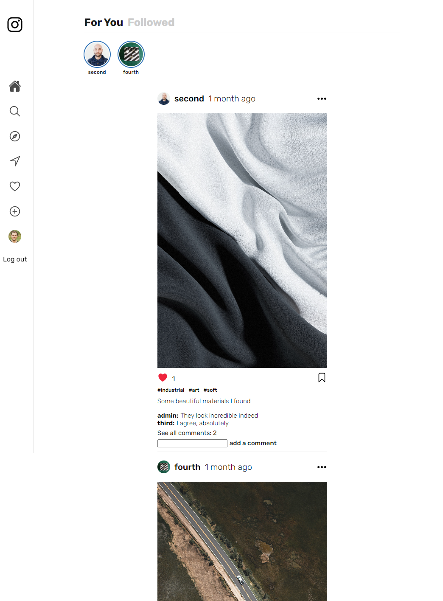
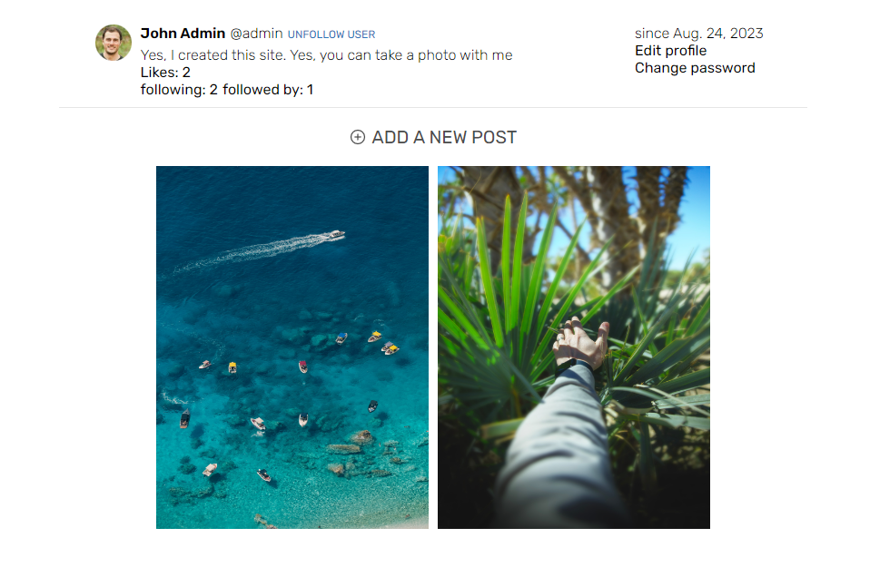
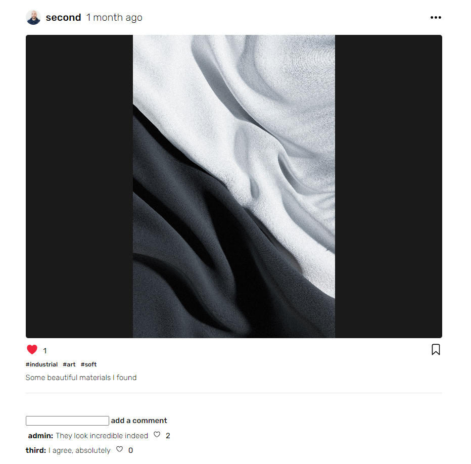
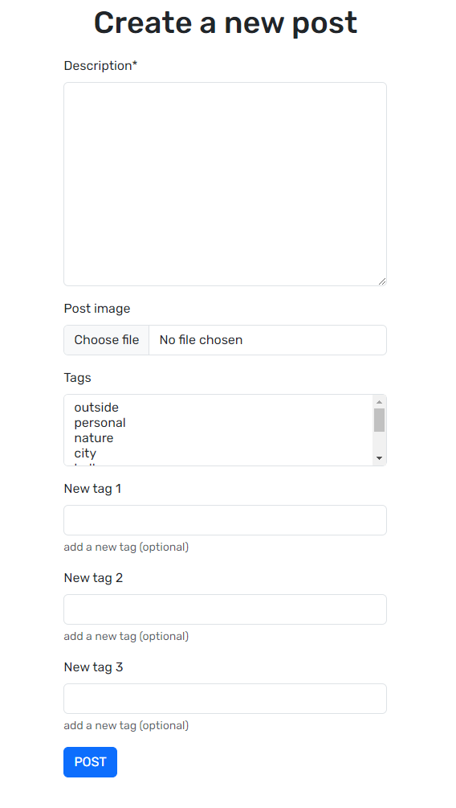
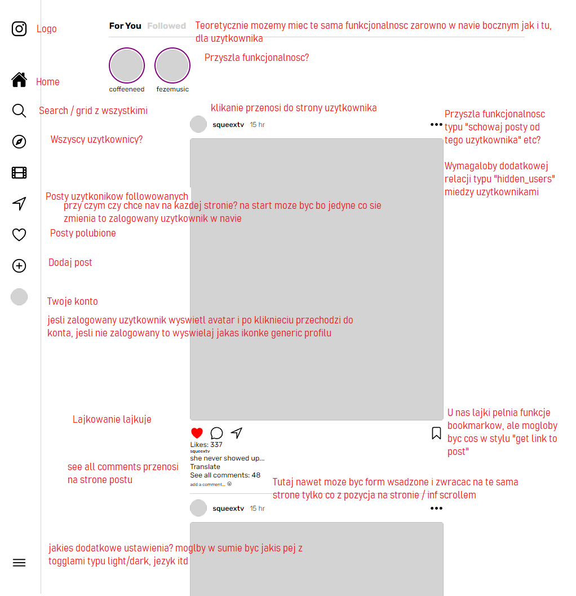

# Projekt realizacji glownej funkcjonalnosci Insta w Django z HTMX
[ENG](README_ENG.md)

**Uruchamianie**:[WIP]
```
1. pip install -r requirements.txt
2. manage.py runserver
3. localhost:8000
```
Jako przetestowanie sie w tworzeniu projektow z Django jako fullstack, a nie jedynie backend z DRF

## Główne funkcjonalności
1. Strona główna z postami użytkownikow wyświetlanymi chronologicznie, z paginacją w postaci tzw. infinite scroll
2. Posty składajace się z obrazka, opisu, tagów i komentarzy
3. Możliwosc lubienia postów i komentarzy
4. Możliwosc śledzenia użytkowników i wyświetlania tylko ich postów
5. Grid wszystkich postów z wyszukiwaniem po tagach i opisie
6. Konto użytkownika ze statystykami, profilem, możliwośc edycji

Opcjonalne funkcjonalności:
1. Opcje typu blokowanie użytkowników, nie wyświetlanie ich postów
2. Ustawienia typu dark mode, język
3. 

## Struktura projektu

### Aplikacje Django:

**instaapp**
Główne funkcjonalności związane z:
- wyświetlaniem postów (home, grid)
- tworzeniem, aktualziacją i usuwaniem postów
- lubieniem postów
- dodawaniem, lubieniem komentarzy

**users**
- Wyświetlanie profili, śledzenie użytkowników

**accounts**
- Tworzenie, edycja, logowanie kont


## Zastosowane rozwiązania:

- Wykorzystanie wbudowanej obsługi kont i autoryzacji Django
- Połączenie one-to-one kont z profilami z dodatkowymi informacjami o użytkowniku
- Do tworzenia, edycji postów, profili zastosowane django model forms
- W celu realizacji lubienia postów i komentarzy, śledzenia użytkowników, lubienia postów bez odświeżania strony (potrzebnej do aktualizacji danych z serweru Django) zastosowane **HTMX** oraz tzw. partial views, tzn. częściowe elementy stron zawarte w głównych stronach, odświeżające tylko siebie w przypadku polubienia postu etc

Strony główne projektu:
Strona główna


Strona użytkownika


Strona postu


Strona tworzenia postu


+ Strony edycji postów, profili użytkowników, wyświetlania postów z opcją filtracji

### Devnotes:
[DEVNOTES](DEVNOTES.md)

### Todos:
[TODOS](TODOS.md)


#### Inne:
Plan funkcjonalnosci glownej strony:
